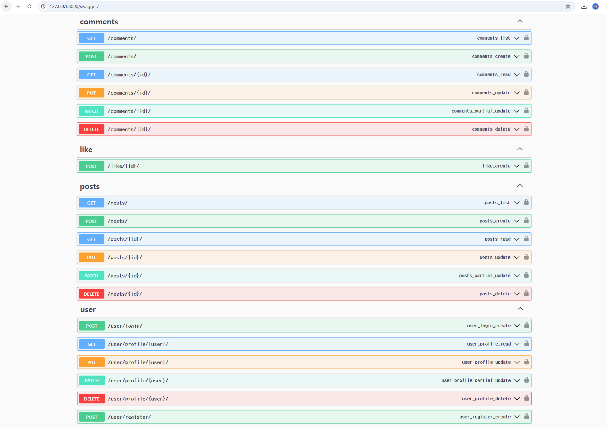
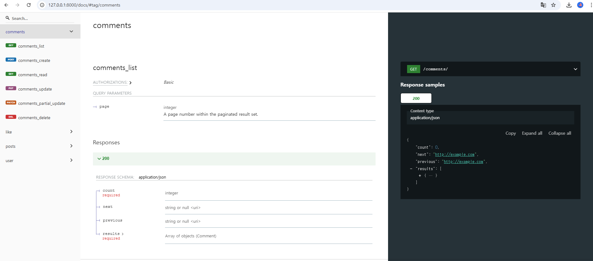

# PyPost 게시판 프로젝트
이 프로젝트는 "백엔드를 위한 Django REST Framework with 파이썬"에 실린 게시판 예제를 기반으로 진행되었습니다.   
회원가입 및 로그인 기능을 구현했으며, 게시글과 댓글에 대한 CRUD API를 개발했습니다.
추가적으로 개발 과정에서 테스트하는 코드를 적용해보았습니다.

## 기간
2024.11.16 ~ 2024.11.19

## 주요 기능
1. 게시판 API 서비스 구현   
    - 회원 관리
        - Django의 기본 User 테이블과 OneToOne 관계를 갖는 Profile 테이블 구성
        - 중복 검증 및 비밀번호 검증을 통한 회원가입 기능 구현
        - 회원의 생성, 수정, 삭제 기능
        - 로그인 시 토큰 기반 인증 구현
    - 게시글 관리
        - 게시글 조회, 생성, 수정, 삭제 기능
        - 좋아요 기능 구현
        - 게시글 관련 기능에 권한 설정 적용
    - 댓글 관리
        - 댓글 조회, 생성, 수정, 삭제 기능
2. Test 코드 구현   
   - 각 API 기능에 대한 테스트 코드 작성
3. Docker 기반 개발 환경 구성
   - Docker Compose를 이용해 일관된 개발 환경 구성

## 기술 스택
    - 백엔드: Django REST Framework
    - 데이터베이스: Django ORM (SQLite3)
    - 컨테이너: Docker

## 설정 및 실행
1. 저장소 클론   
    ``` bash
    git clone https://github.com/rlozl15/pypost.git
    cd pylog
      ```
2. Docker 환경 준비   
    - Docker Desktop을 실행
3. Docker 이미지 빌드 및 실행
    ```
    docker-compose up -d --build
    ```
4. Django 마이크레이션
    ```
    docker-compose exec app python manage.py migrate
    ```
5. Django API 문서 확인
    - Swagger 또는 API Docs 문서를 확인
        - Swagger: http://localhost:8000/swagger/
        - API Docs: http://localhost:8000/docs/



